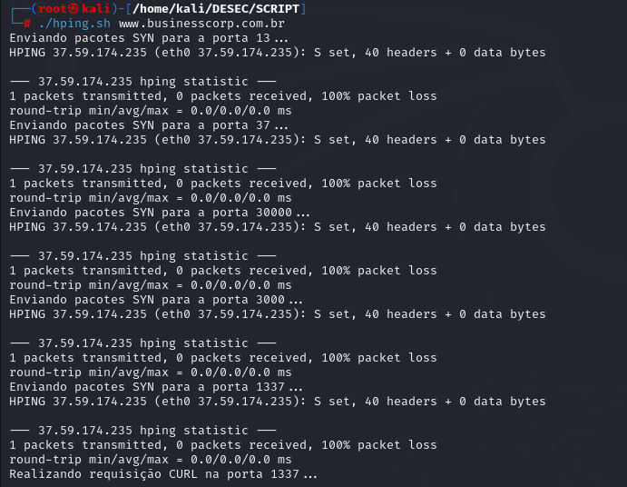

# Envio de pacotes SYN com hping3

## Código script Bash

´´´ Bash

#!/bin/bash

# Definir o endereço IP de destino
TARGET_IP="37.59.174.235"

# Definir as portas a serem testadas
PORTS=(13 37 30000 3000 1337)

# Enviar pacotes SYN para as portas definidas
for PORT in "${PORTS[@]}"; do
    echo "Enviando pacotes SYN para a porta $PORT..."
    hping3 -S -p "$PORT" -c 1 "$TARGET_IP"
done

# Realizar uma requisição CURL na porta 1337
echo "Realizando requisição CURL na porta 1337..."
curl "$TARGET_IP:1337"

´´´

## Script

## Saída

